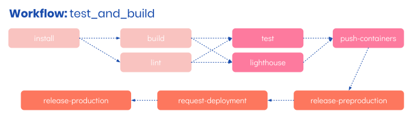

# CI Pipeline
To make various build, test, and deploy tasks easy to run continuously we use [CircleCI][]. Our pipeline makes use of the [Jobs]() and [Workflows]() functionality CircleCI provides, which is controlled via the file, `config.yaml`, in the `.circle/` folder. 

The CI Pipeline is simply a collection of jobs, which can be ran in different workflows. Right now, we have one workflow; it looks like this,

## The "test_and_build" workflow
The test_and_build workflow defines the following jobs that run before anything is deployed,

- __install:__ Pulls in any sub-modules and kicks off an install of the project
- __build:__ Builds any frontend projects into prod friendly assets
- __lint:__ Ensures package wide linting rules are satisfied
- __test:__ Runs package wide testing scripts to ensure all tests pass
- __lighthouse:__ Runs Lighthouse, a web quality tool, for each frontend project
- __push-containers:__ Builds and pushes new images to the applicable store

Some jobs have a dependency on others and require them to successfully complete. You can see this on the diagram above and also more clearly in the __config.yaml__ file mentioned earlier.

At this point a successful build will attempt to push images for each applicable package, in our case, [titus-frontend]() and [titus-backend](). Which container repo images are pushed can be controlled via the `DOCKER_REPO` variable in __config.yaml__.

### Auto releasing into pre-production
To ensure CI conventions are being followed, Titus includes default support for the notion of a staging or pre-production environment. Assuming all the steps above have ran successfully the step below will run,

- __release-preproduction:__ Using [Helm](), deploy to a pre-production env running [K8s]()

The exact details of the release tools used can be found in the [Deployment]() section.

### Guarded release to Production
Assuming a pre-production release has been completed and validated by users, the next step is to deploy to production. By making use of CirceCI's "Approval" job type Titus will guard against automatic deploys to production but still make it easy to kick one off when the time is right using the steps below.

- __request_deployment:__ A manual step which requires approval inside CircleCI
- __release-production:__ Using [Helm](), deploy to a production env running [K8s]()

## Understanding what gets deployed

[CircleCI]: /
