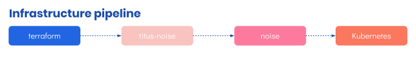

![titus-devops-quote][]

# DevOps
Deployment for Titus is a fully featured, modern, production grade experience. There are a number of ways to look at Titus' deployment tooling. For simplicity the pipeline can be broken it down into two types of deployment, Infrastructure, which is handled via [Noise]() and [Terraform]() and Services, which is handled by helm.

To keep concerns separated Titus (this repo) is deployed to AWS, using CircleCI. It's infrastructure configuration is in a repo named `titus-infra-aws` and it's service configuration is in `titus-deploy`.

## Setting up Infrastructure

### On AWS
To Do.

### On Azure
Azure documentation will follow once we have an Azure pipelines file in place.

## Setting up CI Deployment

### On AWS
To Do.

### On Azure
Azure documentation will follow once we have an Azure pipelines file in place.

### Infrastructure
Titus runs on [Kubernetes]() and can be deployed to [Azure](), [AWS]() and [GCP](). Low level infrastructure is managed by [Terraform](), with service level infrastructure managed by [Kubernetes](). Services are deployed using [CircleCI]() which runs [Helm]() to handle service updates to the running cluster.

Titus makes use of [Noise]() which is a Terraform plugin that that understands how to set up Kubernetes and deploy different types of infrastructure and service with ease. We wrap __Noise__ in a configuration repo, [titus-noise](), which includes:

- A configured Noise plugin
- Helm charts to locate and deploy containers and services

- For more detail see our [Infrastructure Pipeline Guide](devops/ci-pipeline.md)

## Apps & Services
Titus includes a fully featured, production ready, CI Pipeline. Titus uses CircleCI as it's infrastructure of choice for continuous integration. The Titus CI Pipeline includes all of the steps needed to build assets, lint and test, as well as pushing containers and deployment proper. 

- For more detail see our [CI Pipeline Guide](devops/ci-pipeline.md).

#### Guides

##### Adding a new service or app helm chart

[CircleCI]: /

<!-- Images -->
[titus-devops-quote]: ../img/titus-devops-quote.svg
