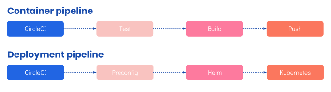

# DevOps

## Overview
Deployment for Titus is a fully featured, modern, production grade experience. There are a number of ways to look at Titus' deployment tooling. The pipeline can be broken into two types of deployment:
* Infrastructure - handled by [Taurus] and [Terraform]
* Services - handled by Helm.

Fig.1 Titus Infrastructure Pipeline

To keep concerns separated, Titus is deployed to AWS using CircleCI. Its infrastructure configuration is in a repo named [titus-infra-aws] and its service configuration is in [titus-deploy].

## Deploy Titus
Titus runs on [Kubernetes] and can be deployed to [Azure] and  [AWS]. Low-level infrastructure is managed by [Terraform], with service-level infrastructure managed by [Kubernetes].

Titus uses [Taurus], a Terraform plugin that that understands how to set up Kubernetes and deploy different types of infrastructure and service with ease. We wrap __Taurus__ in a configuration repo, __titus-infra-*__ (where the provider's name is appended to the name), which includes:

- A configured Taurus plugin via the `main.tf` file
- Any additional Terraform or other customised deployment scripts

How to set up the infrastructure varies from provider to provider, so provider specific guides are listed below.
**Note:** You need to be proficient with your chosen provider as well as in Terraform.

### Deploy Titus on AWS Using CircleCI
Services are deployed using [CircleCI] which runs [Helm] to handle service updates to the running cluster.

Refer to [Deploy Titus on AWS Using CircleCI](devops/aws/) for more details.

### Deploy Titus on Azure Using Pipelines
Azure documentation will follow when an Azure pipelines file is available.

Refer to [Deploy Titus on Azure Using Pipelines](devops/azure/) for more details, when available.

## Build, Test and Deploy Using the CI Pipeline
Titus includes a fully featured, production-ready CI pipeline. Titus uses CircleCI as its infrastructure of choice for continuous integration. The Titus CI pipeline includes all of the steps needed to build assets, lint and test, push containers, and deploy.

Fig.2 Titus CI Pipeline

For more information, refer to [Build, Test and Deploy Using CI Pipelines](devops/ci-pipeline/).

## Add a New Helm Chart

Refer to [Add a New Helm Chart](devops/helm-chart/) for more details.

[CircleCI]: https://circleci.com
[Taurus]: https://nf-taurus.netlify.com/#/
[titus-infra-aws]: https://github.com/nearform/titus-infra-aws
[titus-deploy]: https://github.com/nearform/titus-deploy
[Terraform]: https://www.terraform.io
[Azure]: https://azure.microsoft.com
[AWS]: https://aws.amazon.com
[Helm]: https://helm.sh
[Kubernetes]: https://kubernetes.io
