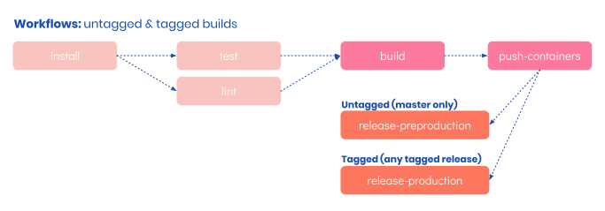

![titus-devops-quote]

# DevOps
Deployment for Titus is a fully featured, modern, production grade experience. There are a number of ways to look at Titus' deployment tooling. For simplicity the pipeline can be broken it down into two types of deployment, Infrastructure, which is handled via [Taurus] and [Terraform] and Services, which is handled by helm.

To keep concerns separated Titus (this repo) is deployed to AWS, using CircleCI. It's infrastructure configuration is in a repo named [titus-infra-aws] and it's service configuration is in [titus-deploy].

## Setting up Infrastructure
Titus runs on [Kubernetes] and can be deployed to [Azure], [AWS]. Low level infrastructure is managed by [Terraform], with service level infrastructure managed by [Kubernetes].

Titus makes use of [Taurus] which is a Terraform plugin that that understands how to set up Kubernetes and deploy different types of infrastructure and service with ease. We wrap __Taurus__ in a configuration repo, __titus-infra-*__ (where the providers name is appended to the name), which includes:

- A configured Taurus plugin via a `main.tf` file
- Any additional terraform or other scripts custom to the deployment

The exact nature of how to set up infrastructure varies from provider to provider, so is broken down into provider specific guides below. Note, you will need to be proficient with your chosen provider as well as in Terraform. The guides below are not suitable to learn either.

## Deployment on AWS using CircleCI
Services are deployed using [CircleCI] which runs [Helm] to handle service updates to the running cluster.

- [Detailed walk through](devops/aws/)

## Deployment on Azure using Pipelines
Azure documentation will follow once we have an Azure pipelines file in place.

Stay tuned!

- [Detailed walk through](devops/azure/)

## Apps & Services
Titus includes a fully featured, production ready, CI Pipeline. Titus uses CircleCI as it's infrastructure of choice for continuous integration. The Titus CI Pipeline includes all of the steps needed to build assets, lint and test, as well as pushing containers and deployment proper.

## Guides

- [Adding a new service or app helm chart](devops/helm-chart.md)
- [CI Pipeline Guide](devops/ci-pipeline.md)

[CircleCI]: https://circleci.com
[Taurus]: https://nf-taurus.netlify.com/#/
[titus-infra-aws]: https://github.com/nearform/titus-infra-aws
[titus-deploy]: https://github.com/nearform/titus-deploy
[Terraform]: https://www.terraform.io
[Azure]: https://azure.microsoft.com
[AWS]: https://aws.amazon.com
[Helm]: https://helm.sh
[Kubernetes]: https://kubernetes.io

<!-- Images -->
[titus-devops-quote]: ../img/titus-devops-quote.svg
