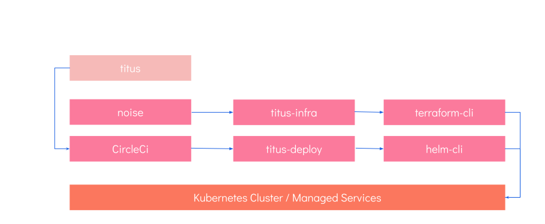

# DevOps
Deployment for Titus is a fully featured, modern, production grade experience. There are a number of ways to look at Titus' deployment tooling. For simplicity the pipeline can be broken it down into two types of deployment, Infrastructure, which is handled via [Noise] and [Terraform] and Services, which is handled by helm.



To keep concerns separated Titus (this repo) is deployed to AWS, using CircleCI. It's infrastructure configuration is in a repo named `titus-infra-aws` and it's service configuration is in `titus-deploy`.

## Setting up Infrastructure
Titus runs on [Kubernetes] and can be deployed to [Azure], [AWS]. Low level infrastructure is managed by [Terraform], with service level infrastructure managed by [Kubernetes].

Titus makes use of [Noise] which is a Terraform plugin that that understands how to set up Kubernetes and deploy different types of infrastructure and service with ease. We wrap __Noise__ in a configuration repo, __titus-infra-*__ (where the providers name is appended to the name), which includes:

- A configured Noise plugin via a `main.tf` file
- Any additional terraform or other scripts custom to the deployment

The exact nature of how to set up infrastructure varies from provider to provider, so is broken down into provider specific guides below. Note, you will need to be proficient with your chosen provider as well as in Terraform. The guides below are not suitable to learn either.

## Setting up CI Deployment
Services are deployed using [CircleCI] which runs [Helm] to handle service updates to the running cluster.

### On AWS using CircleCI

To setup the titus deployment on an AWS environment making use of CircleCI there is several steps to run through and consider.
The current circleci config is setup to have the team work on branches that gets commited to a master and at a code freeze
the team would release tag the current master that also would be running in the dev environment. And that would trigger a propagation
of the dev image into the production / staging environment.


#### Setup the EKS environment.

1. Make sure you have your management environment setup in accordance to the Noise documnentation. See: [Setup Local management env](https://nearform.github.io/noise/#/setup-local/)

1. Clone [titus-infra-aws] to a new folder
   ```sh
   git clone git@github.com:nearform/titus-infra-aws.git
   ```

1. Clone [Noise] to a new folder either
   ```sh
   git clone git@github.com:nearform/noise.git
   ```

1. Add a symlink to noise inside titus-infra-aws
  ```sh
  cd titus-infra-aws
  ln -s ../noise
  ```

1. Create an S3 bucket in accordance to Noise instructions found here: [Create an S3 bucket for terraform state](https://nearform.github.io/noise/#/providers/aws/).
You dont need to run terraform steps from the Noise instructions.

1. Go into the `titus-infra-aws/` folder and edit the `main.tf` file.

  __Change values:__

  * Set appropriate region in provider.
  * Set appropriate aws_region in module.
  * Set provider profile to the same profile as your local environment.
  * Set appropriate project name
  * Terraform -> Backend -> Bucket : To the name of the bucket you created above.
  * If you want to also change the name on the backend bucket defined in the last lines of the main.tf file.

1. Now run the command `terraform plan` and with some luck you have no errors and a report of 90+ resources creaated.

1. Run the command: `terraform apply` - type yes when asked and sit back.


#### Customize your infrastructure

1. Fork [titus-deploy] repository on github, and clone it
   ```sh
   git clone git@github.com:your-name/titus-deploy.git
   ```

1. in `titus-starter-kit/values.dev.yaml` edit
  ```yaml
  env:
    name: "titus-dev"
    env_label: "dev"
    host: "titus-preprod.nearform.com"
  ```
  To provide values according to your project. In particular, provide a DNS host you manage *and that has a CNAME in AWS Route53*

1. perform similar changes in `titus-starter-kit/values.prod.yaml` for your production environement

1. Commit you changes and push them to your fork

1. TODO In your titus-deploy repository you will have a chart that is called helm-secrets

1. TODO Read through the [README.md](https://github.com/nearform/titus-deploy/tree/master/titus-secrets) provided in the helm chart as it will explain the process of creating and maintaing your secrets. And keep them a secret.

1. TODO Install the secrets helm chart


#### Configure CirclecI

This assumes you've already forked [Titus] repository. CircleCI will access and deploy it.


1. On CircleCI UI, add your project by searching the project under `Add projects`.
  It will add a deployment key for you repository and setup the necessary hooks.
  Make sure you have admin access to the repository todo this.

1. In order for CircleCI to access your titus-deploy fork, in CircleCI titus project settings:
  - go to `Permissions` > `Checkout SSH keys`
  - In `Add user key`, click on `Create and add user key` button
  - Authenticate with Github (if not already), and complete the operation

1. Under CircleCI project environment variables add:
  - `AWS_ACCESS_KEY_ID`
  - `AWS_SECRET_ACCESS_KEY`
  - `AWS_DEFAULT_REGION`: AWS region hosting the infrastructure
  - `S3_BUCKET`: name of the S3 bucket in titus-infra-aws's `main.tf`: `aws_s3_bucket.b.name`

  These values should have been used during the standup of the Noise environment that support Titus.

1. In titus repo, update the values in `.circleci/config.yaml`:
  - `DOCKER_REPO`: in AWS console, ECR service, use the URI, ie: `123456789.dkr.ecr.eu-west-1.amazonaws.com`
  - `TITUS_DEPLOY_REPO`: add your titus-deploy fork: `git@github.com:your-name/titus-deploy.git`
  - `AWS_ECR_REGION`: AWS region hosting the infrastructure
  - `AWS_EKS_REGION`: AWS region hosting the infrastructure


#### First deploy

Just Commit your changes, and push them!


### On Azure
Azure documentation will follow once we have an Azure pipelines file in place.

### Infrastructure


## Apps & Services
Titus includes a fully featured, production ready, CI Pipeline. Titus uses CircleCI as it's infrastructure of choice for continuous integration. The Titus CI Pipeline includes all of the steps needed to build assets, lint and test, as well as pushing containers and deployment proper.


- For more detail see our [CI Pipeline Guide](devops/ci-pipeline.md).

### Guides

- Adding a new service or app helm chart

[CircleCI]: https://circleci.com
[Noise]: https://nearform.github.io/noise
[titus-infra-aws]: https://github.com/nearform/titus-infra-aws
[titus-deploy]: https://github.com/nearform/titus-deploy
[Terraform]: https://www.terraform.io
[Azure]: https://azure.microsoft.com
[AWS]: https://aws.amazon.com
[Helm]: https://helm.sh

<!-- Images -->
[titu__s-devops-quote]: ../img/titus-devops-quote.svg
