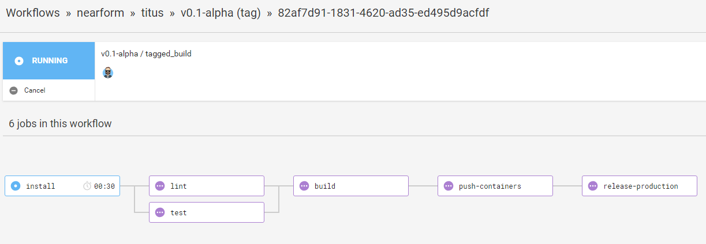

# CI Pipeline
To make various build, test, and deploy tasks easy to run continuously we use [CircleCI][]. Our pipeline makes use of the [Jobs]() and [Workflows]() functionality CircleCI provides, which is controlled via the `config.yaml` file in the `.circle/` folder. 

The CI Pipeline is simply a collection of jobs which can be ran in different workflows. Right now, we have two workflows that share a number of jobs; it looks like this:

Hello!

## The Workflows
Both workflows define the following jobs that run before anything is deployed:

- __install:__ Pulls in any sub-modules and kicks off an install of the project
- __build:__ Builds any frontend projects into prod friendly assets
- __lint:__ Ensures package wide linting rules are satisfied
- __test:__ Runs package wide testing scripts to ensure all tests pass
- __push-containers:__ Builds and pushes new images to the applicable store

Some jobs have a dependency on others and require them to successfully complete. You can see this on the diagram above and also more clearly in the __config.yaml__ file mentioned earlier.

At this point a successful build will attempt to push images for each applicable package. Where container images are pushed can be controlled via the `DOCKER_REPO` variable in __config.yaml__.

### Auto releasing into pre-production
To ensure CI conventions are being followed, Titus includes default support for the notion of a staging or pre-production environment. Assuming all the steps above have ran successfully the step below will run each time a merge or commit happens to the __master__ branch:

- __release-preproduction:__ Using [Helm](), deploy to a pre-production env running [K8s]()

### Guarded release to Production
Assuming a pre-production release has been completed and validated by users, the next step is to deploy to production proper. To deploy to production, a tag must be created in git and pushed to the repo. Generally tags should be made off of master, but any tag will kick off the final step, which is:

- __release-production:__ Using [Helm](), deploy to a production env running [K8s]()

[CircleCI]: /
