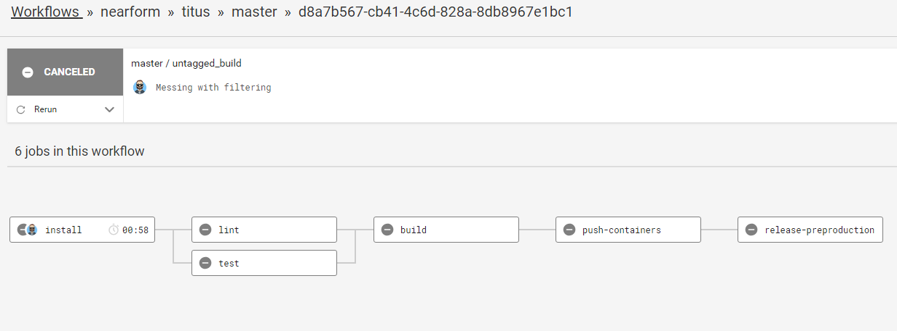
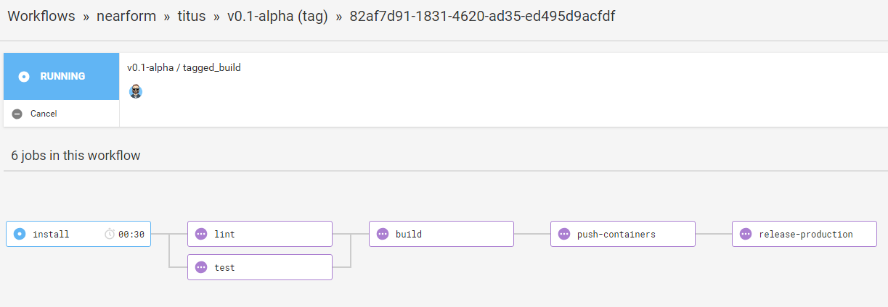

# The CI Pipeline
To simplify the continuous build, test and deploy tasks, we use [CircleCI][]. Our pipeline uses the [Jobs]() and [Workflows]() functionality that CircleCI provides, which is controlled by the `config.yaml` file in the `.circle/` folder.

The CI Pipeline is a collection of jobs that can be executed in different workflows. We have two workflows that share a number of jobs; it looks like this:

Hello!

# The Workflows
Both workflows define the following jobs that run before anything is deployed:

- __install:__ Pulls in submodules and starts an install of the project
- __build:__ Builds any frontend projects into production friendly assets
- __lint:__ Ensures package-wide linting rules are satisfied
- __test:__ Runs package-wide testing scripts to ensure all tests pass
- __push-containers:__ Builds and pushes new images to the applicable store

Some jobs have a dependency on others. If so, this requires jobs to successfully complete before starting another. You can see this on the diagram above and also in the __config.yaml__ file mentioned earlier.

A successful build attempts to push images for each applicable package. The `DOCKER_REPO` variable in __config.yaml__ controls where container images are pushed.

### Autorelease into Preproduction
To ensure CI conventions are followed, Titus includes default support for staging or preproduction environment. If all the steps above were successful, the step below will run each time a merge or commit happens to the __master__ branch:

- __release-preproduction:__ Using [Helm](), deploy to a preproduction environment running [K8s]()

### Guarded Release into Production
If your preproduction release has completed and been validated, you can deploy into production. To deploy to production, a tag must be created in Git and pushed to the repo. Generally tags are made off of master, but any tag will start the final step, as follows:

- __release-production:__ Using [Helm](), deploy to a production environment running [K8s]()

[CircleCI]: /
