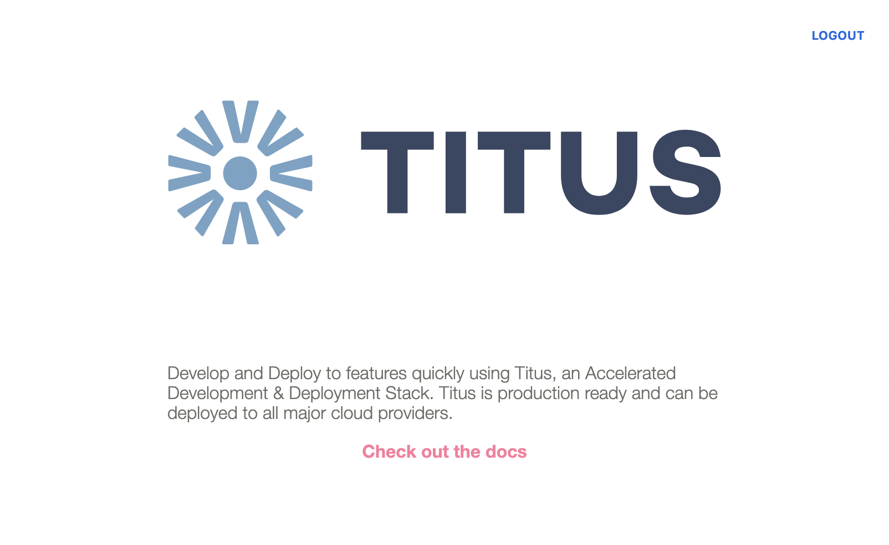

![quick-start-quote][]

# Quick start

Titus is easy to install and run. We encourage developers to install Titus locally themselves - it should feel easy to navigate around, start and stop. Before we go further however, let's ensure you have all of the prerequisites installed. 

You will need the latest stable versions of [Node][], and [Docker][]. Both of these should be trivial to install and do not require any special setup. There are other tools to install for deployment purposes, these will be covered later in the [DevOps][] section of this documentation.

## Clone the source repo
To kick everything off, fork [Titus][] on Github, it will be easier to maintain your own fork as Titus is designed to diverge, it is unlikely you will need to pull from the source repository again outside of some minor cherry-picking.

Once you have your fork, clone a copy of it locally:

```sh
git clone https://github.com/<your-fork>/titus.git
```

## Install dependencies
Since Titus is a Lerna monorepo, there are two ways to kick off an install. While in the root folder of the project, run the following npm command:

```sh
npm install
```

or, should you have Lerna installed globally, you can also run:

```sh
lerna bootstrap
```

In both cases dependencies are installed for all constituent parts of the repository.

## Configure the environment
Titus uses `.env` files in each package to control various configuration. In all cases there are `.sample.env` files documenting what values should be in the `.env` file proper.

However, before the stack can be ran, the actual `.env` files need to be created and populated. A convenience script exists to automate this process. 

To generate a default set of `.env` files for all packages, run the following command in the root of the project:

```sh
npm run create:env
```

## Running the stack
Titus runs locally on Docker. To facilitate easier development docker is set to run watched versions of both the front and backend. This means as you make and save changes, those changes should be reflected automatically in the containers. 

Ensure Docker has started on your machine before running the stack. To run the full stack, in the root of the project, run:

```sh
npm run start:all
```

Running the command `docker ps` will produce a log of the running set of containers, one for each service, frontend, backend, and the Postgres database. It should look something like this:

```sh
CONTAINER ID        IMAGE                         NAMES
d4673b6d74f9        nearform/alpine3-s2i-nodejs   titus-frontend
6d3d2fc5da44        titus_api                     titus-backend
e553c840fbdc        postgres:10.4-alpine          titus-db
```

Congratulations! You are now running titus locally. Check the `docker-compose.yml` file in the root of the repository for specifics of what is running in docker and how it is composed.

### Logging in
The running application can be accessed at `localhost:3000` in any modern web browser. First access will require you to log into the system:


The login is set to accept any reasonable username and password. On successful login you will see
the splash page for Titus:



The splash screen will link you back to the documentation (here) should you not have started from the titus site. Note that you can also log out of the system on the splash screen.

### Manipulating the  running stack
A number of useful commands for manipulating the running docker stack have been included as easy to run scripts. These can be ran by running `npm run <command>` in the root of the repo; where command is:

- `docker:dev:exec`
  - Runs `docker-compose exec api` to get fast access to the backend container
- `docker:dev:logs`: 
  - Runs `docker-compose logs` and passes `-f` so they auto-tail
- `docker:dev:migrate` 
  - Runs `docker-compose exec api npm run migrate` which asks the backend to run migrations
- `docker:dev:rmi`
  - Runs `docker-compose down` but passes ` --rmi all` to tear down the system fully
- `docker:dev:seed`
  - Runs `docker-compose exec api npm run dev:seed` which asks the backend to run data seeding
- `docker:dev:start` 
  - First, runs `create:pg:volume` to create a data volume 
  - Then, `docker-compose up -d --build` to start the system locally in docker
- `docker:dev:stop`
  - Runs `docker-compose down` to spin down the running system

For example, to tear down the system, spin it back up and tail the logs, the commands would be:

```sh
npm run docker:dev:rmi
npm run docker:dev:start   // or just start:all for short
npm run docker:dev:logs
```

### Stopping the stack
You can can also stop the stack by running:

```sh
npm run stop:all
```

While this command will stop the system it will not delete the stack containers or volumes. To delete the containers produced run:

```sh
npm run docker:dev:rmi
```

### Linting and Testing
Linting and testing can be ran can across the stack by running `npm run <command>` in the root of the repo; where command can be one of:

- `lint:all`
  - Runs the `lint` command in each package that has one
- `test:all`
  - Runs the `test` command in each package that has one

Both frontend and backend starter kits have linting and testing built in and as such should run green in both cases by default, and red should any change violate the included rules.

## Next steps

- Deep dive into our documentation for [Developers][].
- See our detailed [DevOps][] documentation.


<!-- External Links -->
[Noise]: https://nearform.github.io/noise
[titus-noise-cli]: https://github.com/nearform/titus-noise-cli
[CircleCI]: https://circleci.com/product/#features
[Docker]: https://www.docker.com/
[Node]: https://nodejs.org/en/
[OpenID Connect]: https://openid.net/connect/ 
[Titus]: https://github.com/nearform/titus

<!-- Internal Links -->
[DevOps]: devops/
[Developers]: developers/


<!-- Images -->
[quick-start-quote]: ../img/titus-quick-start-quote.svg
